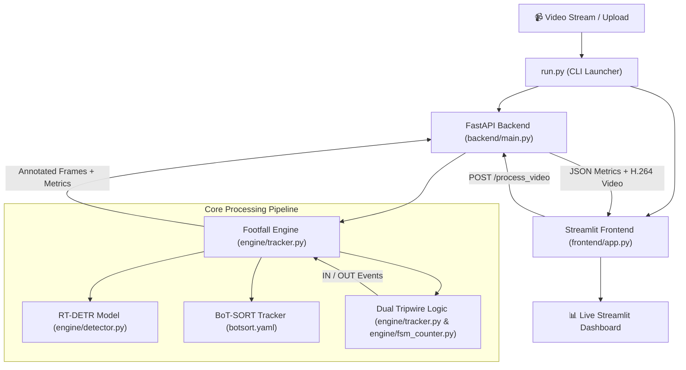

# ProGlint Footfall Intelligence — Code Pinpoint & Quick Reference Guide

> **Purpose of this guide:** If anyone asks you *"Where is X?"*, *"How does Y work?"*, or *"Which file does Z?"*, this document gives you the exact file path, function name, and line numbers so you can pinpoint and explain it immediately.

---

## 1. High-Level Architecture Map



---

## 2. The "What Is Where" Pinpoint Table

| Question / Feature | File Path | Line Range | Function / Code Symbol |
| :--- | :--- | :--- | :--- |
| **Model Weights & Path Fallback** | [`engine/tracker.py`](file:///D:/yasmin%20programs/PROGLINT/engine/tracker.py#L5-L11) | Lines 5–11 | `CUSTOM_WEIGHTS_PATH`, `get_default_model_path()` |
| **Engine Initialization** | [`engine/tracker.py`](file:///D:/yasmin%20programs/PROGLINT/engine/tracker.py#L14-L22) | Lines 14–22 | `FootfallEngine.__init__()` |
| **Live Occupancy Formula** | [`engine/tracker.py`](file:///D:/yasmin%20programs/PROGLINT/engine/tracker.py#L28) | Line 28 | `@property def occupancy -> total_in - total_out` |
| **Object Detection & BoT-SORT** | [`engine/tracker.py`](file:///D:/yasmin%20programs/PROGLINT/engine/tracker.py#L44-L46) | Lines 44–46 | `self.model.track(frame, persist=True, classes=[0], conf=0.50, iou=0.5, tracker='botsort.yaml')` |
| **HARD FILTER (Conf >= 0.50)** | [`engine/tracker.py`](file:///D:/yasmin%20programs/PROGLINT/engine/tracker.py#L55) | Line 55 | `if conf < 0.50: continue` (Rejects phantom box swarms) |
| **Foot Coordinate Extraction** | [`engine/tracker.py`](file:///D:/yasmin%20programs/PROGLINT/engine/tracker.py#L60) | Line 60 | `cx, cy = int((x1 + x2) / 2), int(y2)` |
| **Dual Tripwire FSM & Counters** | [`engine/tracker.py`](file:///D:/yasmin%20programs/PROGLINT/engine/tracker.py#L63-L79) | Lines 63–79 | `prev_cy < y_a <= cy` (IN), `prev_cy > y_a >= cy` (OUT) |
| **Minimal Clean Drawing** | [`engine/tracker.py`](file:///D:/yasmin%20programs/PROGLINT/engine/tracker.py#L83-L87) | Lines 83–87 | 1 green box, 1 clean ID tag, 1 small green dot at feet |
| **Tripwires & Top-Left HUD** | [`engine/tracker.py`](file:///D:/yasmin%20programs/PROGLINT/engine/tracker.py#L90-L96) | Lines 90–96 | Cyan Line A, Magenta Line B, top-left HUD banner |
| **Full Video Processing Loop** | [`engine/tracker.py`](file:///D:/yasmin%20programs/PROGLINT/engine/tracker.py#L98-L117) | Lines 98–117 | `FootfallEngine.process_video()` |
| **FastAPI App Setup & CORS** | [`backend/main.py`](file:///D:/yasmin%20programs/PROGLINT/backend/main.py#L17-L25) | Lines 17–25 | `app = FastAPI(...)`, `CORSMiddleware` |
| **Health Check API (`/health`)** | [`backend/main.py`](file:///D:/yasmin%20programs/PROGLINT/backend/main.py#L46-L56) | Lines 46–56 | `@app.get("/health")` |
| **Video Processing API** | [`backend/main.py`](file:///D:/yasmin%20programs/PROGLINT/backend/main.py#L59-L113) | Lines 59–113 | `@app.post("/process_video")` |
| **Video Streaming API** | [`backend/main.py`](file:///D:/yasmin%20programs/PROGLINT/backend/main.py#L115-L121) | Lines 115–121 | `@app.get("/videos/{filename}")` |
| **H.264 Video Transcoder** | [`backend/main.py`](file:///D:/yasmin%20programs/PROGLINT/backend/main.py#L27-L34) | Lines 27–34 | `transcode_to_h264()` via FFmpeg |
| **UI Calibration Sliders** | [`frontend/app.py`](file:///D:/yasmin%20programs/PROGLINT/frontend/app.py#L40-L45) | Lines 40–45 | Sidebar: Line A (0.45), Line B (0.55), Timeout (3.0s) |
| **UI 4 KPI Metric Cards** | [`frontend/app.py`](file:///D:/yasmin%20programs/PROGLINT/frontend/app.py#L69-L73) | Lines 69–73 | `Total IN`, `Total OUT`, `Current Occupancy`, `FPS` |
| **UI Dynamic Calibration Preview**| [`frontend/app.py`](file:///D:/yasmin%20programs/PROGLINT/frontend/app.py#L52-L56) | Lines 52–56 | First frame calibration preview before processing |
| **UI Output Video & Step Chart** | [`frontend/app.py`](file:///D:/yasmin%20programs/PROGLINT/frontend/app.py#L75-L81) | Lines 75–81 | `st.video()` and Plotly stepped net occupancy graph |
| **UI Event Log Table** | [`frontend/app.py`](file:///D:/yasmin%20programs/PROGLINT/frontend/app.py#L83-L86) | Lines 83–86 | `st.expander("Crossing Event Log")` |
| **System Launcher CLI** | [`run.py`](file:///D:/yasmin%20programs/PROGLINT/run.py#L15-L51) | Lines 15–51 | `python run.py [backend\|frontend\|both]` |
| **Benchmark Suite** | [`evaluation/benchmark.py`](file:///D:/yasmin%20programs/PROGLINT/evaluation/benchmark.py#L20-L70) | Lines 20–70 | `run_benchmark()` |

---

## 3. How to Answer Common Questions in 10 Seconds

### Q1: "Where is the AI model loaded and run?"
> **Answer:** In [`engine/tracker.py:L14-22`](file:///D:/yasmin%20programs/PROGLINT/engine/tracker.py#L14-L22), the RT-DETR model is initialized with `self.model = RTDETR(self.model_path)`. During frame processing at **Line 44**, `self.model.track(frame, persist=True, classes=[0], conf=0.50, iou=0.5, tracker='botsort.yaml')` is executed to detect pedestrians and track them simultaneously.

### Q2: "How did you eliminate phantom box swarms and clutter?"
> **Answer:** In [`engine/tracker.py:L55`](file:///D:/yasmin%20programs/PROGLINT/engine/tracker.py#L55):
> ```python
> if conf < 0.50:
>     continue  # HARD FILTER: Discard low-confidence phantom detections
> ```
> Low-confidence noise (< 0.50) is discarded before bounding box drawing or tracking updates. Only 1 crisp green box and 1 green dot at the feet `(cx, cy)` are drawn per pedestrian.

### Q3: "How does the counting work (Dual Tripwires)?"
> **Answer:** In [`engine/tracker.py:L63-79`](file:///D:/yasmin%20programs/PROGLINT/engine/tracker.py#L63-L79):
> 1. Two horizontal lines exist: **Line A (Cyan)** at `y_a` and **Line B (Magenta)** at `y_b`.
> 2. Foot coordinate `cy = int(y2)` tracks the ground contact point.
> 3. Downward crossing (`prev_cy < y_a <= cy` $\rightarrow$ `prev_cy < y_b <= cy`) triggers `total_in += 1`.
> 4. Upward crossing (`prev_cy > y_b >= cy` $\rightarrow$ `prev_cy > y_a >= cy`) triggers `total_out += 1`.
> 5. Current occupancy is simply `total_in - total_out` ([`tracker.py:L28`](file:///D:/yasmin%20programs/PROGLINT/engine/tracker.py#L28)).

### Q4: "How do you prevent double-counting?"
> **Answer:** In [`engine/tracker.py:L71-78`](file:///D:/yasmin%20programs/PROGLINT/engine/tracker.py#L71-L78):
> Once a pedestrian finishes crossing both lines, their state is locked to `"DONE"`. They cannot re-trigger a count while on that track. If they turn around before completing the transit, the state resets back to `"IDLE"`.

### Q5: "What if someone lingers in the gate area?"
> **Answer:** In [`engine/tracker.py:L64-65`](file:///D:/yasmin%20programs/PROGLINT/engine/tracker.py#L64-L65):
> If a pedestrian lingers in `PENDING_IN` or `PENDING_OUT` for longer than `timeout_sec` (default 3.0s), the state resets to `"IDLE"`.

### Q6: "Where are the API endpoints?"
> **Answer:** In [`backend/main.py`](file:///D:/yasmin%20programs/PROGLINT/backend/main.py):
> - `GET /health` (Line 46): returns GPU status, model name, and tracker.
> - `POST /process_video` (Line 59): accepts uploaded video and tripwire coordinates, runs the tracking engine, transcodes video to web-friendly H.264, and returns the metrics.
> - `GET /videos/{filename}` (Line 115): serves the processed video stream to the browser.

### Q7: "Where is the User Interface?"
> **Answer:** In [`frontend/app.py`](file:///D:/yasmin%20programs/PROGLINT/frontend/app.py) (<100 lines, built with Streamlit):
> - Sidebar: Line A slider, Line B slider, timeout slider.
> - Top header: 4 KPI metric cards (`Total IN`, `Total OUT`, `Current Occupancy`, `FPS`).
> - Main layout: Dynamic calibration preview, processed video player, Plotly occupancy graph, and expandable crossing event log table.

### Q8: "How do you launch the application?"
> **Answer:** Run:
> ```bash
> python run.py both
> ```
> This starts the FastAPI backend on `http://127.0.0.1:8000` and the Streamlit frontend on `http://127.0.0.1:8501`.
