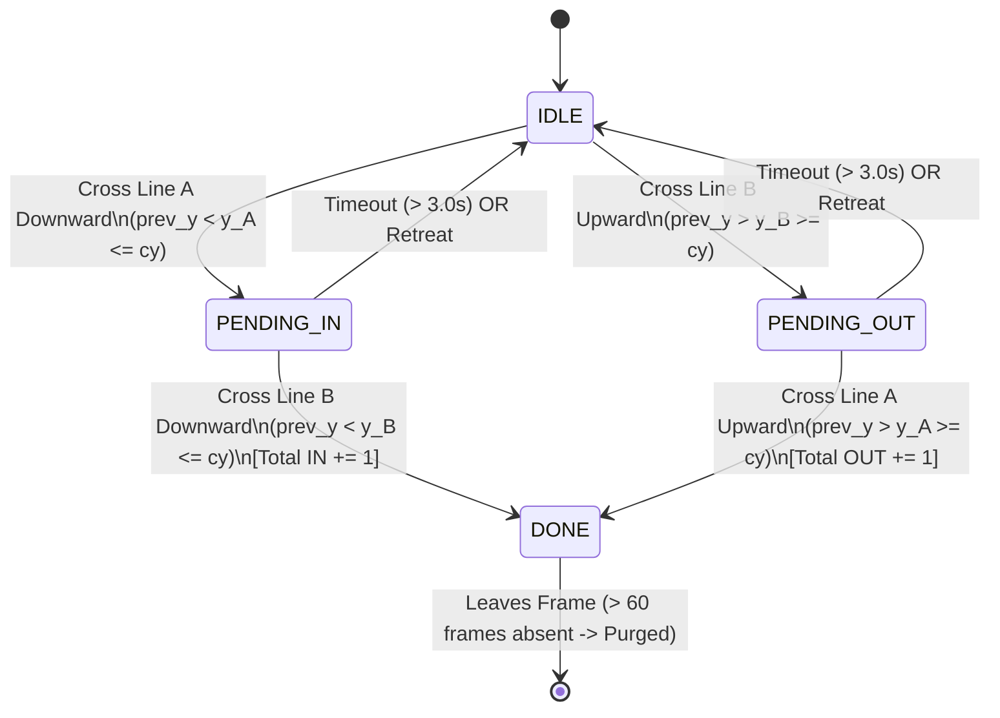

# Document 4: Counting, FSM, and Duplicate Prevention (Person 3 Core)

## 1. What Is Person 3's Role?

As **Person 3**, you are the **System Accountant and Logic Integrator**.
You receive continuous streams of tracked objects from Person 2:
```python
(tid, [x1, y1, x2, y2])
```
From these numbers, your job is to:
1. Extract the physical contact point with the floor ($\mathbf{P}_{\text{feet}}$).
2. Maintain virtual tripwire boundaries (Line A and Line B).
3. Execute a directional **Finite State Machine (FSM)** for every active pedestrian.
4. Enforce strict mathematical filters against duplicate counts, hesitation, and loitering.
5. Compute real-time analytics: **Total IN**, **Total OUT**, and **Net Occupancy**.
6. Render the head-up display (HUD) overlay and feed data into the web API.

---

## 2. Coordinates & Virtual Tripwires

### Screen Coordinate System
In computer vision:
- The origin $(0, 0)$ is at the **top-left**.
- $X$ increases to the **right** ($0 \le x < W$).
- $Y$ increases **downwards** ($0 \le y < H$).

### Foot-Point Calculation
In [`engine/tracker.py`](file:///D:/yasmin%20programs/PROGLINT/engine/tracker.py#L55-L57):
```python
x1, y1, x2, y2 = [int(round(float(c))) for c in box]
cx = int((x1 + x2) / 2)   # Horizontal midpoint
cy = y2                   # Ground contact point (FEET)
```
We track the bottom-center coordinate $(c_x, c_y = y_2)$ because the human foot is the only point in rigid, invariant contact with the physical floor plane.

### Virtual Tripwires: Line A & Line B
Rather than a single line, we deploy two horizontal lines:
```python
line_a_norm = 0.45   # 45% of frame height (Outer Tripwire, Cyan)
line_b_norm = 0.55   # 55% of frame height (Inner Tripwire, Magenta)
y_a = int(line_a_norm * h)
y_b = int(line_b_norm * h)
```
For a $1080\text{p}$ stream ($H = 1080$):
- $y_A = 0.45 \times 1080 = 486\text{ px}$
- $y_B = 0.55 \times 1080 = 594\text{ px}$

```
       EXTERIOR / OUTSIDE ZONE (y < y_A)
   ════════════════════════════════════════════════ Line A (y_a = 486) [Cyan]
       TRANSIT DEADBAND (Hysteresis Buffer: Δy = 108 px)
   ════════════════════════════════════════════════ Line B (y_b = 594) [Magenta]
       INTERIOR / INSIDE ZONE (y > y_B)
```

---

## 3. Why a Single Tripwire Fails in Production

| Failure Mode | Single-Line Tripwire | Our Dual-Tripwire FSM Solution |
| :--- | :--- | :--- |
| **Boundary Loitering** | A person standing directly on the line shifting foot weight crosses back and forth repeatedly, firing dozens of false counts. | Pedestrian oscillates inside the deadband ($\Delta y$). Counts require crossing **both** lines sequentially. |
| **Hesitation / Retreat** | A person approaches the door, touches the line, changes their mind, and walks away. Counts as an entry! | Pedestrian crosses Line A (`PENDING_IN`), but never crosses Line B. State times out and resets to `IDLE` with **0 count**. |
| **Directional Ambiguity** | An instantaneous line cut cannot determine whether traversal into the building was completed. | Downward traversal ($A \rightarrow B$) is verified **IN**. Upward traversal ($B \rightarrow A$) is verified **OUT**. |

---

## 4. The Finite State Machine (FSM) Architecture

Every active track ID maintains an individual state vector in `self.history`:
```python
self.history[tid] = [prev_y, state, t_start, frames_absent, start_y]
```
- `prev_y`: Vertical coordinate in the previous frame.
- `state`: Current state (`IDLE`, `PENDING_IN`, `PENDING_OUT`, `DONE`).
- `t_start`: Epoch timestamp when the pending transition began.
- `frames_absent`: Counter tracking consecutive frames the person was not detected.
- `start_y`: Vertical coordinate when the person first spawned (used for the motion filter).



### Mathematical State Transition Rules in Code:

```python
# 1. Check for temporal timeout (Lingering inside deadband)
if (now - t_start) > timeout and state in ("PENDING_IN", "PENDING_OUT"):
    state = "IDLE"

# 2. Stationary motion filter (Displacement must exceed 15 pixels)
has_moved = abs(cy - start_y) > 15

# 3. State transitions
if state == "IDLE":
    if prev_y < y_a <= cy:
        state, t_start = "PENDING_IN", now
    elif prev_y > y_b >= cy:
        state, t_start = "PENDING_OUT", now

elif state == "PENDING_IN" and prev_y < y_b <= cy:
    if has_moved:
        self.total_in += 1
        self.events.append({"frame": frame_idx, "id": tid, "type": "IN", "time_sec": round(now, 2)})
    state = "DONE"

elif state == "PENDING_OUT" and prev_y > y_a >= cy:
    if has_moved:
        self.total_out += 1
        self.events.append({"frame": frame_idx, "id": tid, "type": "OUT", "time_sec": round(now, 2)})
    state = "DONE"
```

---

## 5. Duplicate Prevention: The 4 Defense Layers

To guarantee zero duplicate counts under all edge cases, we enforce four distinct safeguards:

### 1. The `DONE` State Lock
Once a pedestrian completes a crossing sequence, their state transitions to `DONE`. In our code:
- Transitions to `PENDING_IN` or `PENDING_OUT` **require** `state == "IDLE"`.
- Once locked at `DONE`, no further crossing events can ever trigger for that Track ID while in the camera view.

### 2. The Minimum Displacement Filter (`has_moved > 15px`)
If a security guard sits or stands directly between Line A and Line B, small detector bounding box fluctuations ($\pm 3\text{ px}$) could cause the coordinates to flicker.
`has_moved = abs(cy - start_y) > 15` ensures that stationary jitter is completely ignored.

### 3. The Temporal Timeout Latch (`timeout = 3.0s`)
If a person steps across Line A into the deadband, stops to check their phone for 5 seconds, and then walks back outside:
- The elapsed time $(now - t_{\text{start}}) > 3.0\text{ s}$ expires.
- State resets cleanly to `IDLE`.
- No false entry is recorded.

### 4. Active Memory Garbage Collection
In [`engine/tracker.py`](file:///D:/yasmin%20programs/PROGLINT/engine/tracker.py#L90-L94):
```python
for tid in list(self.history.keys()):
    if tid not in active_ids:
        self.history[tid][3] += 1  # Increment frames_absent
        if self.history[tid][3] > 60:
            del self.history[tid]   # Purge from memory
```
- When a person walks out of the camera view, they are retained for $60\text{ frames}$ (~$2\text{ seconds}$ at $30\text{ FPS}$) to survive temporary detector drops.
- Once absent for $>60\text{ frames}$, the track dictionary entry is deleted, ensuring RAM usage stays flat during 24/7 continuous operation.

---

## 6. Concrete Walkthrough: Person 7, Person 8, Person 9

Assume frame height $H = 1000\text{ px}$:
- **Line A:** $y_A = 450\text{ px}$
- **Line B:** $y_B = 550\text{ px}$
- **Initial State:** $\text{Total IN} = 0$, $\text{Total OUT} = 0$, $\text{Occupancy} = 0$.

```
Initial Scoreboard: IN: 0 | OUT: 0 | OCCUPANCY: 0
```

---

### Step 1: Person 7 $\rightarrow$ IN (Downward Crossing)

```
        Pedestrian 7 Trajectory: Moving Downwards (y = 300 -> 480 -> 580)
   
   Frame 10:  cy = 300   y < y_A (Outside)          state = "IDLE", start_y = 300
   ════════════════════════════════════════════════ Line A (y_A = 450)
   Frame 25:  cy = 480   prev_y(300) < 450 <= 480   state = "PENDING_IN", t_start recorded
   ════════════════════════════════════════════════ Line B (y_B = 550)
   Frame 40:  cy = 580   prev_y(480) < 550 <= 580   state = "DONE"
                                                    total_in += 1  ==> IN = 1
```
1. **Frame 10:** Person 7 enters frame from the top ($y=300$). Initialized with `state = "IDLE"`, `start_y = 300`.
2. **Frame 25:** Person 7 moves to $y=480$.
   - Condition check: `prev_y (300) < y_A (450) <= cy (480)`.
   - Action: `state` becomes `"PENDING_IN"`. Timestamp $t_{\text{start}}$ is stored.
3. **Frame 40:** Person 7 crosses Line B to $y=580$.
   - Condition check: `state == "PENDING_IN"` and `prev_y (480) < y_B (550) <= cy (580)`.
   - Motion displacement: $|580 - 300| = 280\text{ px} > 15\text{ px}$.
   - Action: `total_in` increments to **1**. `state` transitions to `"DONE"`. Event logged.
4. **Frame 50+:** Person 7 walks further into the building ($y=700$). Because `state == "DONE"`, no further counts occur.

$$\text{Scoreboard: } \mathbf{\text{IN} = 1} \mid \mathbf{\text{OUT} = 0} \mid \mathbf{\text{OCCUPANCY} = 1}$$

---

### Step 2: Person 8 $\rightarrow$ OUT (Upward Crossing)

```
        Pedestrian 8 Trajectory: Moving Upwards (y = 700 -> 520 -> 380)
   
   Frame 60:  cy = 700   y > y_B (Inside)           state = "IDLE", start_y = 700
   ════════════════════════════════════════════════ Line B (y_B = 550)
   Frame 75:  cy = 520   prev_y(700) > 550 >= 520   state = "PENDING_OUT", t_start recorded
   ════════════════════════════════════════════════ Line A (y_A = 450)
   Frame 90:  cy = 380   prev_y(520) > 450 >= 380   state = "DONE"
                                                    total_out += 1 ==> OUT = 1
```
1. **Frame 60:** Person 8 appears inside the building ($y=700$). Initialized with `state = "IDLE"`, `start_y = 700`.
2. **Frame 75:** Person 8 walks upward toward the exit, reaching $y=520$.
   - Condition check: `prev_y (700) > y_B (550) >= cy (520)`.
   - Action: `state` becomes `"PENDING_OUT"`. Timestamp $t_{\text{start}}$ is stored.
3. **Frame 90:** Person 8 crosses Line A to $y=380$.
   - Condition check: `state == "PENDING_OUT"` and `prev_y (520) > y_A (450) >= cy (380)`.
   - Motion displacement: $|380 - 700| = 320\text{ px} > 15\text{ px}$.
   - Action: `total_out` increments to **1**. `state` transitions to `"DONE"`. Event logged.

$$\text{Scoreboard: } \mathbf{\text{IN} = 1} \mid \mathbf{\text{OUT} = 1} \mid \mathbf{\text{OCCUPANCY} = 0}$$

---

### Step 3: Person 9 $\rightarrow$ IN (Downward Crossing)

```
        Pedestrian 9 Trajectory: Moving Downwards (y = 250 -> 470 -> 620)
   
   Frame 100: cy = 250   y < y_A (Outside)          state = "IDLE"
   ════════════════════════════════════════════════ Line A (y_A = 450)
   Frame 115: cy = 470   prev_y(250) < 450 <= 470   state = "PENDING_IN"
   ════════════════════════════════════════════════ Line B (y_B = 550)
   Frame 130: cy = 620   prev_y(470) < 550 <= 620   state = "DONE"
                                                    total_in += 1  ==> IN = 2
```
1. Person 9 executes the exact same sequential transition: `IDLE` $\rightarrow$ `PENDING_IN` $\rightarrow$ `DONE`.
2. Counter updated: `total_in` increments from $1$ to **2**.

---

### Final Scoreboard & Audit Summary

$$\mathbf{\text{Total IN} = 2} \qquad \mathbf{\text{Total OUT} = 1} \qquad \mathbf{\text{Net Occupancy} = 1}$$

```json
[
  {"frame": 40, "id": 7, "type": "IN", "time_sec": 1.33},
  {"frame": 90, "id": 8, "type": "OUT", "time_sec": 3.00},
  {"frame": 130, "id": 9, "type": "IN", "time_sec": 4.33}
]
```
